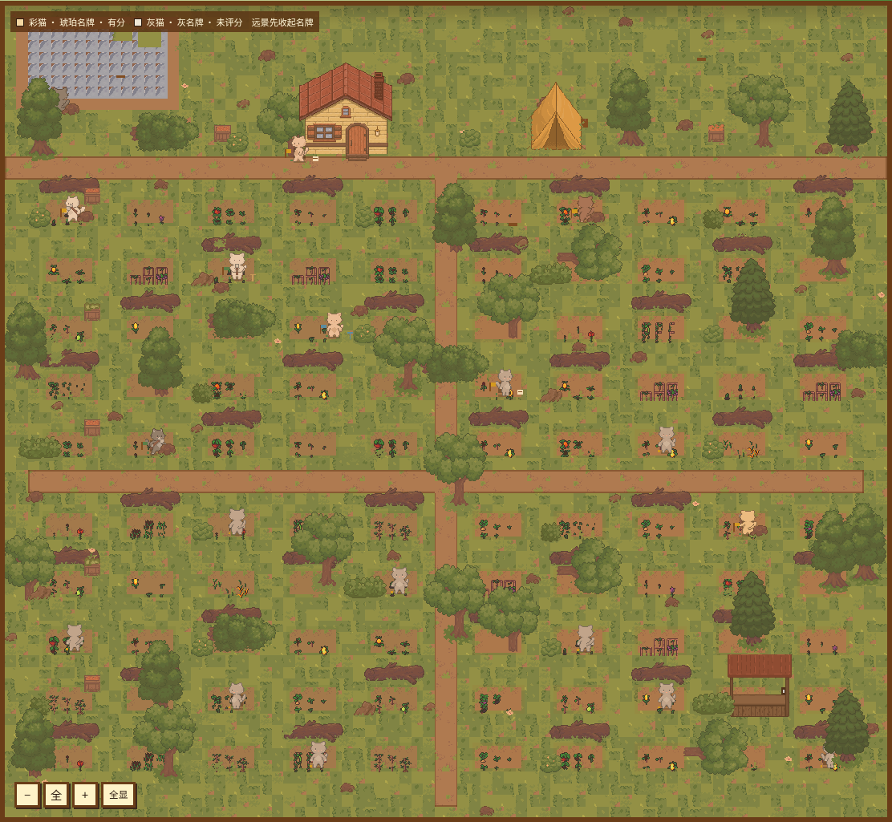
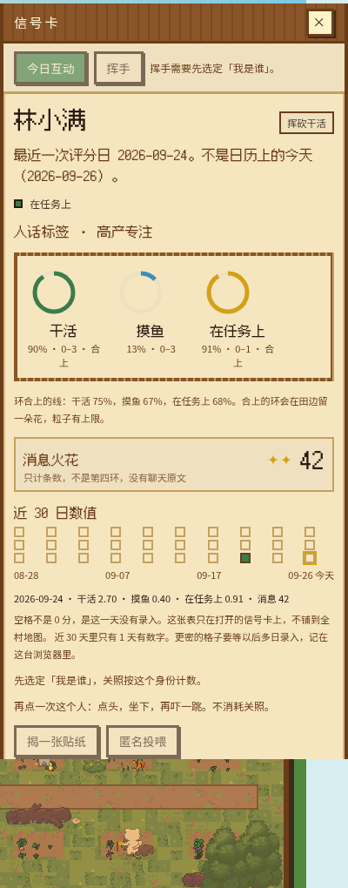
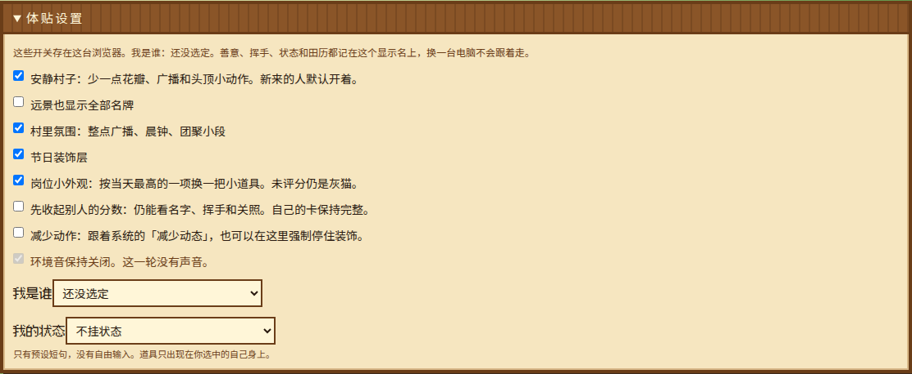

# 像素公司村

Pixel Company Village — a Stardew-style farm where each person is a cat villager. The map shows **numeric scores only** (work, fishing, on-task, message count). It does not collect, store, or show chat text.

**Privacy promise.** 站点不采集、不保存、不展示聊天原文、群消息、截图或扫描路径。允许的只有显示名、日期、数字分数、消息条数，以及一个很短的标签。关照、挥手、体贴设置和 30 天记录都留在这台浏览器里。细节见 [SECURITY.md](SECURITY.md)。

这是玩乐雷达，不是绩效考核。页面会反复写：**代理信号≠绩效；摸鱼分是趣味雷达**。

场景是俯视农庄，画风来自已购买的 Little Wilds 完整包：草地、土路、动画水面、树、房子、悬崖、农具，以及七种毛色的猫咪村民。作物生长阶段是 CC0 的 16px 图。田铺在路两边，每人一块。衣服颜色由姓名决定；未评分的人是浅灰猫，站着发呆，不编分数。名牌用 Fusion Pixel 12px 汉字，按整数倍放大。素材署名见 [CREDITS.md](CREDITS.md)。

仓库里的默认名册是**虚构演示**（林小满、周晚风等），在 `data/demo/`。正式使用时请换成你自己的名册，不要把真实同事姓名提交进公开仓库。



## 快速开始

```bash
npm install
cp .env.example .env.local
```

在 `.env.local` 里写上你自己的值。下面的密码只是例子：

```bash
SITE_PASSWORD=changeme
INGEST_SECRET=
```

`INGEST_SECRET` 请自行生成，例如 `openssl rand -hex 32`。然后：

```bash
npm run dev
```

打开 [http://127.0.0.1:43123](http://127.0.0.1:43123)，用你设置的站点密码登录。一步步说明见 [docs/TUTORIAL.md](docs/TUTORIAL.md)。

## 演示数据与正式名册

| 路径 | 谁用 | 是否提交 |
|---|---|---|
| `data/demo/roster.json` | 公开演示，18 个虚构显示名 | 提交 |
| `data/demo/seed.json` | 公开演示分数，日期 `2026-09-24` | 提交 |
| `data/private/roster.json` | 你自己的名册 | gitignore |
| `data/private/seed.json` | 你自己的种子分数 | gitignore |

没有环境变量时，服务端读演示 JSON。要在某一次部署里使用正式名册，把两份 JSON 做成 base64，只写进宿主的环境变量（不要写进 git）：

```bash
base64 -w 0 data/private/roster.json
base64 -w 0 data/private/seed.json
```

| 变量 | 作用 |
|---|---|
| `VILLAGE_ROSTER_B64` | 可选。覆盖演示名册 |
| `VILLAGE_SEED_B64` | 可选。覆盖演示种子 |

名册上的每个人都会进村。当日分数里 `work` / `fish` / `on_task` 至少有一项不是 0 的人按分数做动画；其余人是灰色未评分，点开写着「名册里有这个人，这一评分日没有三项雷达数字，不会编造。」`scored: false`、缺数字，或三项雷达都是 0，都按未评分处理。

## 部署到 Vercel

分数存在进程内存里。环境变量放在 Vercel 项目设置中，不放进仓库。

```bash
npm i -g vercel
vercel link
vercel env add SITE_PASSWORD production
vercel env add INGEST_SECRET production
vercel --prod
```

正式名册再追加 `VILLAGE_ROSTER_B64` 和 `VILLAGE_SEED_B64`（只选 production）。不设置这两项时，线上也是演示名册。

必填：

| 变量 | 用途 |
|---|---|
| `SITE_PASSWORD` | 进门密码。登录后写入 httpOnly cookie |
| `INGEST_SECRET` | 评分程序写入分数的密钥 |

可选：`NEXT_PUBLIC_VILLAGE_TEST=1` 只在你打算用 Playwright 钩子的预览上打开。生产构建默认没有 `window.__VILLAGE_TEST__`。

Redis、Blob、KV **不用**配置。

## 写入分数

`POST /api/ingest`，`Authorization: Bearer $INGEST_SECRET`。完整说明在 [docs/ingest.md](docs/ingest.md)。

```bash
curl -X POST "$SITE_URL/api/ingest" \
  -H "Authorization: Bearer $INGEST_SECRET" \
  -H "Content-Type: application/json" \
  -d '{
    "date": "2026-09-24",
    "people": [
      {"name": "林小满", "msgs": 42, "work": 2.7, "fish": 0.4, "on_task": 0.91}
    ]
  }'
```

每人字段：`name`、`date` 在顶层、`work` / `fish` / `on_task`、`msgs`（条数）、`scored`。成功时 `store` 为 `memory`。`GET /api/scores` 需要站点密码 cookie。

## 功能



- **信号环。** 干活 `work / 3` 合上线是 75%；摸鱼 `fish / 3` 合上线是 67%；在任务上 `on_task` 合上线是 68%。消息条数只是火花，不是第四环。合上的环在田边开花，安静村子会关掉。
- **关照配额（本机）。** 「今日互动」先打开菜单（种子、咖啡、钓竿、浇水），确认后才扣次数，3 秒内可以撤销。同一人每天 1 次、每周 2 次（上海日历）。周日若这周两次都用过，田边会多亮一下。键是 `village:viewer:<显示名>:kindness`。
- **数据日。** 页头写「数据日」或「最近一次评分日」。分数日期不是今天时，不会把它说成今天。
- **挥手（本机）。** 每人每小时一次，只有写好的动作，没有铃声。
- **季节。** 按月份铺田色。四节固定为立春 02-04、立夏 05-05、立秋 08-07、立冬 11-07。节日只显示全村数字合计，不排名。
- **体贴设置。** 新来的人默认开着「安静村子」。还可以收起别人的分数、减少动作、远景显示全部名牌、关掉广播和节日装饰、关掉岗位小外观。
- **本机玩法。** 整点广播、工作日晨钟、环闭合的小花、熟悉度细边（只在你这台浏览器）、自己的表情、每日贴纸、岗位小道具、团聚点、博物架、拜访周历、节日灯位、匿名投喂、观景羽毛、地块摆件、维度小旗、周日光、村语图鉴、作物阶、邻座高亮、节日小场、私人花园第二层。都不进服务器，也不含聊天原文。匿名投喂的公共记录只留对方显示名；你自己的关照账本仍记在「我是谁」下面，用来扣配额。
- **我是谁。** 选自己的显示名，存在 sessionStorage 和 localStorage。没有选定身份时，关照和挥手不可用。
- **近 30 天。** 只画在打开的那张信号卡上，不铺成全村矩阵。空格是没见过的日子，不是 0 分。记录键 `village:score-history-v1` 留在这台浏览器。



### 动画映射

只用于已评分的人，命中即停：

| 状态 | 条件 | 动画 |
|---|---|---|
| `hard_work` | `work >= 2.0` 且 `work - fish >= 0.5` | Chop 挥砍 |
| `focused` | `work >= 1.2` 且 `on_task >= 0.68` 且 `fish < 1.5` | Watering 浇水 |
| `mixed` | `work >= 1.5` 且 `fish >= 1.5` | Digging 和 Watering 轮流 |
| `fishing` | `fish >= 2.0` 且 `fish > work` | 走到湖边，Hold |
| `slacking` | `fish >= 1.2` 且 `work < 1.2` | Sitting 坐着 |
| `wander` | `work < 1.0` 且 `fish < 1.0` | Walk 沿路溜达 |
| `default` | 以上都不满足 | Idle 田边发呆 |

未评分的人固定浅灰，只播待机。`msgs` 很高时挥锄会稍快一点（最多约 +35%）。浏览器缩放到非整数倍时，画布仍可能发虚；名牌在 1×/2×/3× 下按像素绘制。

## 端到端测试

```bash
npm test
npm run test:e2e
npm run test:e2e:visual
```

`npm test` 跑配额撤销、拜访周历、博物架、文案和加载阶段。`test:e2e` 覆盖登录、硬刷新恢复、关照菜单、挥手、出村、节日小场、移动端、本机配额，以及分数字段白名单。`test:e2e:visual` 对比静帧（安静村子开着），失败不作为合并硬门槛。生产只读冒烟是 `npm run test:e2e:prod`，要另设 `PLAYWRIGHT_PROD=1` 和 `PLAYWRIGHT_BASE_URL`，步骤见 [docs/prod-smoke.md](docs/prod-smoke.md)。Playwright 从环境变量或 `.env.local` 读取 `SITE_PASSWORD`，不要在日志里打印密码。更新视觉基线前确认跑的是 `data/demo/`，而不是正式名册。

## 不会做

- 不镜像聊天，不做消息摘要，也不接模型去总结发言。
- 不做羞辱榜、垫底排名或公开对照表。
- 不把 Redis 当作必需品。配额和历史在本机；服务器只记一份内存里的数字分数。共享配额可以以后再做，当前不做。

## 许可与署名

代码按 [MIT License](LICENSE) 提供。

画面素材另有许可，见 [CREDITS.md](CREDITS.md)：

- [Little Wilds](https://floppycatstudios.itch.io/little-wilds-cozy-rpg-asset-pack)（Floppy Cat Studios，已购买的商业包，仓库不附带 zip）
- [Fusion Pixel](https://github.com/TakWolf/fusion-pixel-font/releases/tag/2026.09.25)（OFL-1.1，TakWolf）
- [Farming crops 16×16](https://opengameart.org/content/farming-crops-16x16)（josehzz，CC0）

安全说明：[SECURITY.md](SECURITY.md)。若密码或密钥曾经出现在聊天或部署日志里，请在宿主上轮换，本仓库只保留空位。
